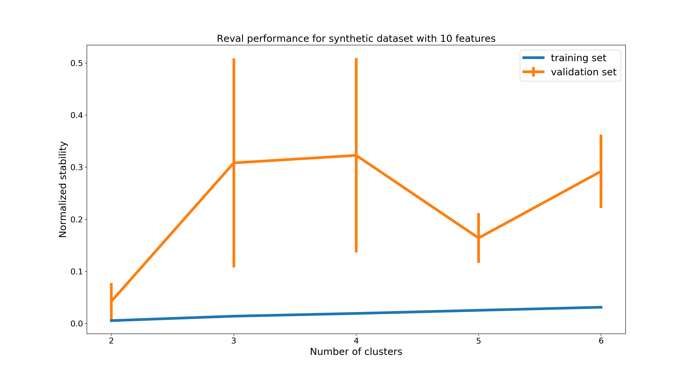
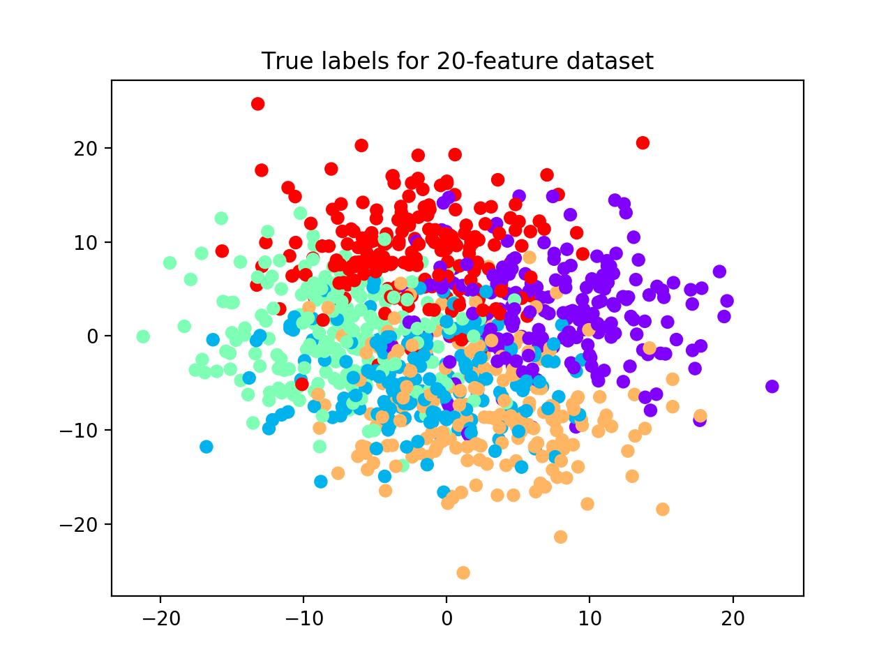
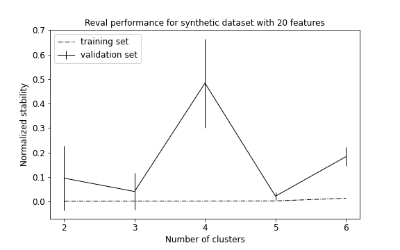
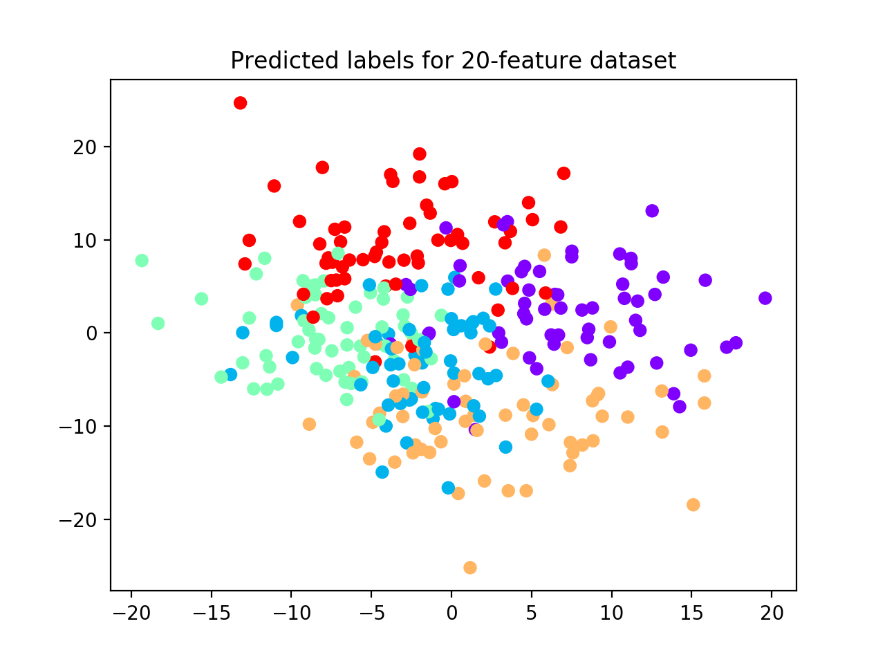
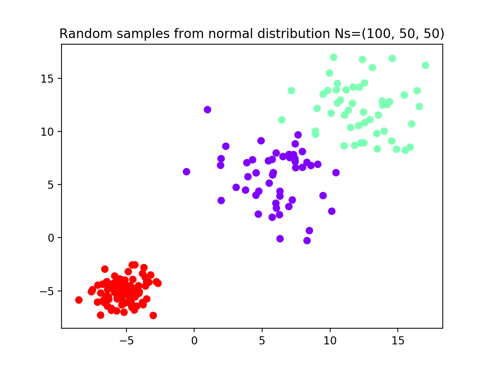
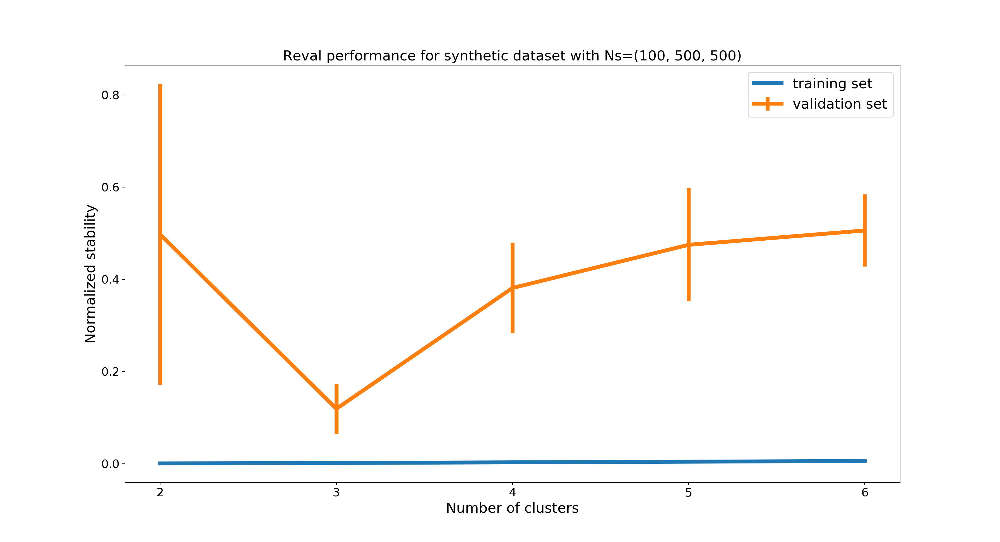
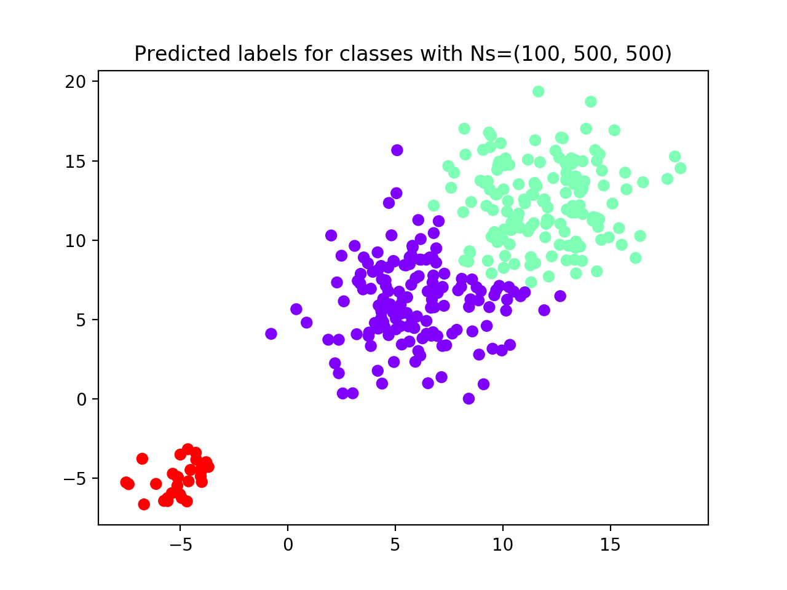

Examples of how things can go wrong
===================================

We discuss now typical situations that might happen when processing real-world datasets and
how these can modify ``reval`` performance. Code can be found in
*reval_clustering/working_examples/*, ``data_dimensionality.py`` file.

Number of features: when enough is enough?
------------------------------------------

With ``make_blobs`` function from ``sklearn.datasets``, we generate a noisy dataset
(i.e., we set ``cluster_std=5``) with 5 classes, 1,000 samples, and 10 features (see scatterplot below).
We partition it into training and test sets (30%) and we apply the relative validation algorithm with 10-fold cross-validation,
number of clusters ranging from 2 to 6, k-nearest neighbors and hierarchical clustering as classification
and clustering algorithms, respectively, and 100 iterations of random labeling.

.. image:: images/classes10.png
    :align: center

.. code:: python3

    from sklearn.datasets import make_blobs
    from sklearn.model_selection import train_test_split
    from reval.best_nclust_cv import FindBestClustCV
    from reval.visualization import plot_metrics
    from sklearn.neighbors import KNeighborsClassifier
    from sklearn.cluster import AgglomerativeClustering
    from sklearn.metrics import adjusted_mutual_info_score, zero_one_loss
    from reval.relative_validation import _kuhn_munkres_algorithm
    import matplotlib.pyplot as plt
    import numpy as np

    data1 = make_blobs(1000, 10, 5, cluster_std=5, random_state=42)

    plt.scatter(data[0][:, 0], data[0][:, 1],
                c=data[1], cmap='rainbow_r')
    plt.title('True labels for 10-feature dataset')

    X_tr, X_ts, y_tr, y_ts = train_test_split(data1[0],
                                              data1[1],
                                              test_size=0.30,
                                              random_state=42,
                                              stratify=data1[1])
    # Apply relative clustering validation with KNN and Hierarchical clustering
    classifier = KNeighborsClassifier()
    clustering = AgglomerativeClustering()

    findbestclust = FindBestClustCV(nfold=10,
                                    nclust_range=[2, 7],
                                    s=classifier,
                                    c=clustering,
                                    nrand=100)
    metrics, nbest, _ = findbestclust.best_nclust(X_tr, y_tr)
    out = findbestclust.evaluate(X_tr, X_ts, nbest)

    plot_metrics(metrics, "Reval performance for synthetic dataset with 10 features")

The algorithm selects 2 as the best clustering solution (see performance plot and scatterplot with predicted labels).

.. image:: images/predlab10.png
    :align: center

We now increase the number of features from 10 to 20 and reapply the relative validation algorithm with the same
parameters as before (see scatterplot with true labels below).

.. code:: python3

    data2 = make_blobs(1000, 20, 5, cluster_std=5, random_state=42)

    plt.scatter(data2[0][:, 0], data2[0][:, 1],
                c=data2[1], cmap='rainbow_r')
    plt.title('True labels for 20-feature dataset')

    X_tr, X_ts, y_tr, y_ts = train_test_split(data2[0],
                                              data2[1],
                                              test_size=0.30, random_state=42,
                                              stratify=data2[1])

    findbestclust = FindBestClustCV(nfold=10, nclust_range=[2, 7],
                                    s=classifier, c=clustering, nrand=100)
    metrics, nbest, _ = findbestclust.best_nclust(X_tr, y_tr)
    out = findbestclust.evaluate(X_tr, X_ts, nbest)

    plot_metrics(metrics, "Reval performance for synthetic dataset with 20 features")

    plt.scatter(X_ts[:, 0], X_ts[:, 1],
                c=out.test_cllab, cmap='rainbow_r')
    plt.title("Predicted labels for 20-feature dataset")

    print(f'AMI test set = {adjusted_mutual_info_score(y_ts, out.test_cllab)}')
    relabeling = _kuhn_munkres_algorithm(y_ts, out.test_cllab)
    print(f'ACC test set = {1 - zero_one_loss(y_ts, relabeling)}')

Because we increased the space volume, data become more sparse, but still preserving their group structure.
For this reason, now the algorithm is able to detect all 5 clusters. (See performance plot and scatterplot).

We use the
`adjusted mutual information score (AMI) <https://scikit-learn.org/stable/modules/generated/sklearn.metrics.adjusted_mutual_info_score.html#sklearn.metrics.adjusted_mutual_info_score>`__
to account for the amount of information shared between true labels and clustering labels returned by the algorithm.
AMI returns 1 when two partitions are identical. Accuracy (ACC) is also used to compare the solutions after the
clustering labels have been permuted to match true labels.
On the test set, we obtain:

.. parsed-literal::

    AMI = 0.98; ACC = 0.99

**Remark**: in situations where we are able to increase the number of features for a dataset,
it is important to remember the
`curse of dimensionality <https://en.wikipedia.org/wiki/Curse_of_dimensionality>`__, i.e.,
the increase of the space dimension determines available data to become sparse and the number of samples required to
detect an effect to grow exponentially. For this reason, increasing the number of features might not help detect
dataset subgroups, because the data would become sparse, hence losing their structure.

Number of samples: too few, not good
----------------------------------------

In small datasets, that we suppose partitioned into groups, the number of samples is important to
an algorithm result. Too few samples, in fact, are usually not representative of data distributions and may
hinder clustering results. In the following, we randomly sample three groups from normal distributions
and we demonstrate how ``reval`` is able to identify the right number of subgroups only if the number of samples is
enough for subgroups with greater standard deviation to reliably represent the different distributions.

The first dataset generated comprises (see scatterplot):

- Group 1 (red): N = 100 random samples from normal distribution with m = -5; sd = 1

- Group 2 (purple): N = 50 random samples from normal distribution with m = 12; sd = 2.5

- Group 3 (green): N = 50 random samples from normal distribution with m = 6; sd = 2.5

We instantiate ``FindBestClustCV()`` class with 10-fold cross validation, k-nearest neighbors classifier and
hierarchical clustering, number of clusters ranging from 2 to 6, and 100 random labeling iterations.

.. code:: python3

    # Set seed for reproducible examples
    np.random.seed(42)

    # We generate three random samples from normal distributions
    data1 = np.random.normal(-5, size=(100, 2))
    data2 = np.random.normal(12, 2.5, size=(50, 2))
    data3 = np.random.normal(6, 2.5, size=(50, 2))
    data = np.append(data1, data2, axis=0)
    data = np.append(data, data3, axis=0)

    label = [0] * 100 + [1] * 50 + [2] * 50

    plt.scatter(data[:, 0], data[:, 1],
                c=label, cmap='rainbow_r')
    plt.title('Random samples from normal distribution Ns=(100, 50, 50)')

    classifier = KNeighborsClassifier()
    clustering = AgglomerativeClustering()

    X_tr, X_ts, y_tr, y_ts = train_test_split(data, label,
                                              test_size=0.30,
                                              random_state=42,
                                              stratify=label)

    # Apply relative clustering validation with KNN and Hierarchical clustering
    findbestclust = FindBestClustCV(nfold=10, nclust_range=[2, 7],
                                    s=classifier, c=clustering, nrand=100)
    metrics, nbest, _ = findbestclust.best_nclust(X_tr, y_tr)
    out = findbestclust.evaluate(X_tr, X_ts, nbest)
    plot_metrics(metrics, "Reval performance for synthetic dataset with Ns=(100, 50, 50)")

    plt.scatter(X_ts[:, 0], X_ts[:, 1],
                c=_kuhn_munkres_algorithm(np.array(y_ts),
                                          out.test_cllab),
                cmap='rainbow_r')
    plt.title(f'Predicted labels for classes with Ns=(100, 50, 50')

Result reports 2 as the best clustering solution (see performance plot and scatterplot). Groups 2 and 3, i.e., with
least number of subjects and higher standard deviation, are considered as a unique group by the algorithm.

.. image:: images/performance1005050.png
    :align: center

.. image:: images/predlab1005050.png
    :align: center

To fix this, we try to increase the number of samples for groups 2 and 3 from 50 to 500 (see scatterplot)
and we rerun the algorithm with the same parameters.

.. image:: images/classes100500500.png
    :align: center

.. code:: python3

    # We now increase the number of samples in groups 2 and 3 to 500
    data1 = np.random.normal(-5, size=(100, 2))
    data2 = np.random.normal(12, 2.5, size=(500, 2))
    data3 = np.random.normal(6, 2.5, size=(500, 2))
    data = np.append(data1, data2, axis=0)
    data = np.append(data, data3, axis=0)

    label = [0] * 100 + [1] * 500 + [2] * 500

    plt.scatter(data[:, 0], data[:, 1],
                c=label, cmap='rainbow_r')
    plt.title('Random samples from normal distribution Ns=(100, 500, 500)')

    classifier = KNeighborsClassifier()
    clustering = AgglomerativeClustering()

    X_tr, X_ts, y_tr, y_ts = train_test_split(data, label,
                                              test_size=0.30,
                                              random_state=42,
                                              stratify=label)

    # Apply relative clustering validation with KNN and Hierarchical clustering
    findbestclust = FindBestClustCV(nfold=10, nclust_range=[2, 7],
                                    s=classifier, c=clustering, nrand=100)
    metrics, nbest, _ = findbestclust.best_nclust(X_tr, y_tr)
    out = findbestclust.evaluate(X_tr, X_ts, nbest)
    plot_metrics(metrics, "Reval performance for synthetic dataset with Ns=(100, 500, 500)")

    plt.scatter(X_ts[:, 0], X_ts[:, 1],
                c=y_ts,
                cmap='rainbow_r')
    plt.title(f'Test set true labels for classes with Ns=(100, 500, 500)')

    plt.scatter(X_ts[:, 0], X_ts[:, 1],
                c=_kuhn_munkres_algorithm(np.array(y_ts),
                                          out.test_cllab),
                cmap='rainbow_r')
    plt.title(f'Predicted labels for classes with Ns=(100, 500, 500')

    # Performance scores
    # Test set ACC
    print(f'Test set external '
          f'ACC = {1 - zero_one_loss(y_ts, _kuhn_munkres_algorithm(np.array(y_ts), out.test_cllab))}')
    print(f"Validation stability metrics: {metrics['val'][nbest]}")
    print(f"Test set model ACC = {out.test_acc}")

This time the algorithm correctly identifies all three groups (see performance plot
and scaterplot with predicted labels).

To evaluate the algorithm performance we compute AMI and ACC between the true and ``reval`` partitions and report the
validation and testing metrics, i.e., normalized stability with 95% CI and testing accuracy, respectively.

.. parsed-literal::

    AMI = 0.75; ACC (external) = 0.93; Normalized stability: 0.1 (0.004; 0.194); ACC = 0.98

Increasing the sampling size, the algorithm was able to correctly identify the three distributions.