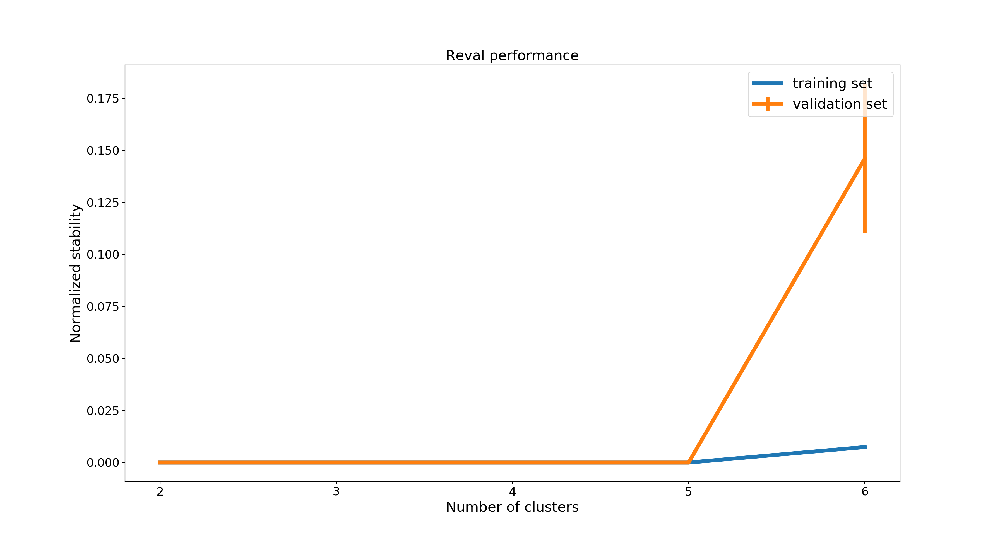
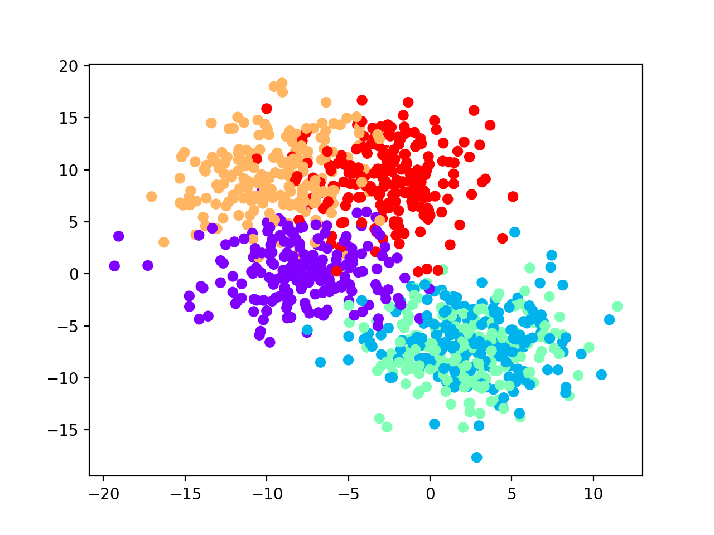
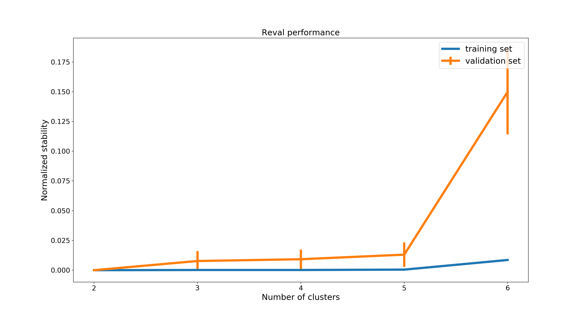
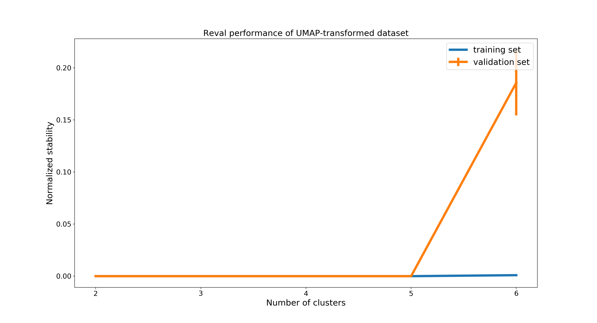
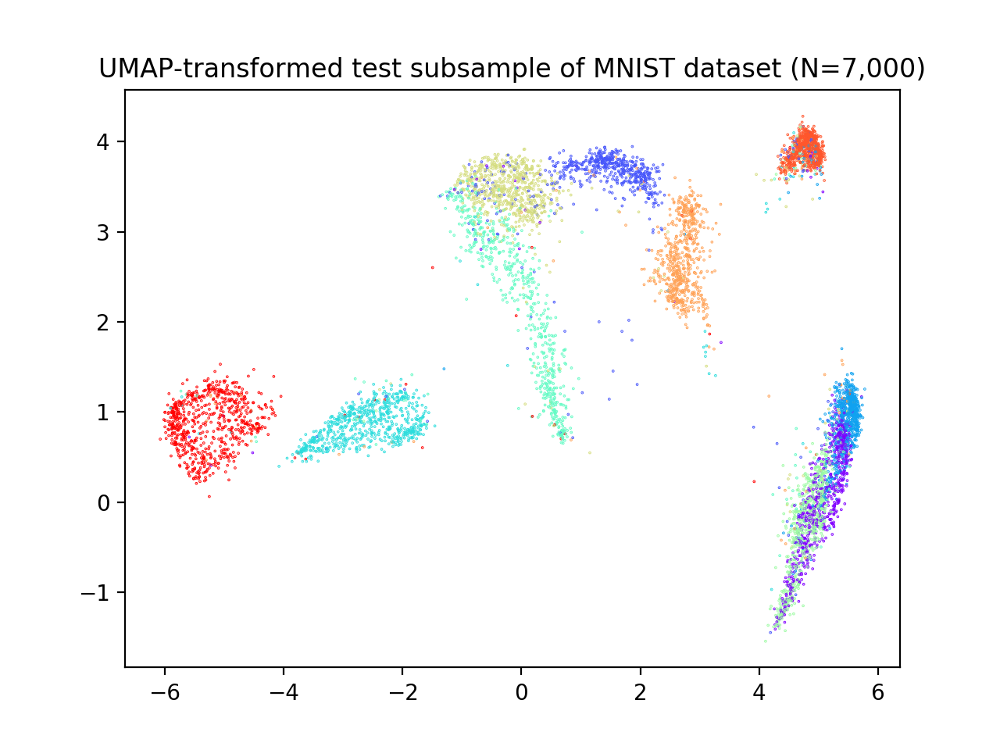
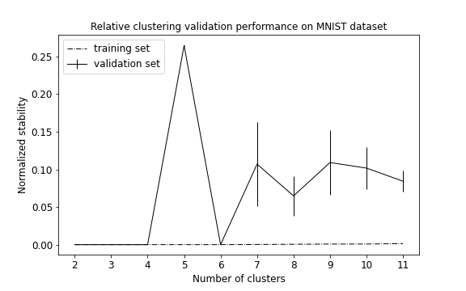
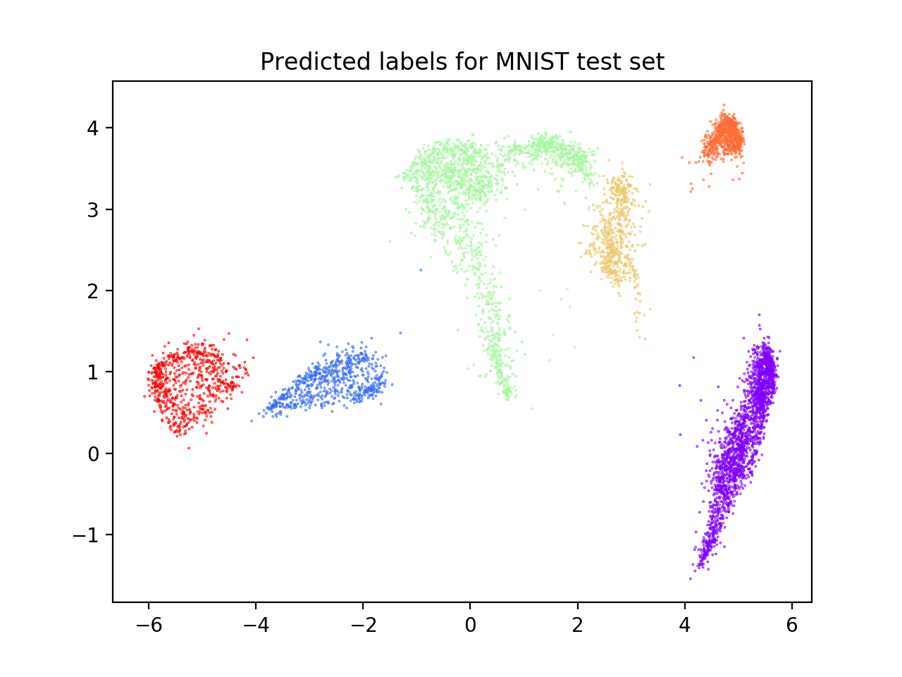

Performance on benchmark datasets
=================================

We present here three examples to test ``reval`` performance. Code can be found in
*reval_clustering/working_examples* folder.

1. N = 1,000 Gaussian blob samples with 10 features divided into 5 clusters (code in ``blobs.py``);

2. N = 1,000 Gaussian blob samples with 10 features divided into 5 clusters with noise parameter *cluster_std*
   set at 3 (code in ``blobs.py``);

3. N = 14,000 samples from the MNIST handwritten digits dataset (code in ``mnist.py``).

Gaussian blobs
--------------

.. code:: python3

    from sklearn.datasets import make_blobs
    from sklearn.model_selection import train_test_split
    from reval.best_nclust_cv import FindBestClustCV
    from sklearn.neighbors import KNeighborsClassifier
    from sklearn.cluster import AgglomerativeClustering
    from sklearn.metrics import zero_one_loss, adjusted_mutual_info_score
    from reval.visualization import plot_metrics
    import matplotlib.pyplot as plt
    from reval.relative_validation import _kuhn_munkres_algorithm

Generate sample dataset and visualize blobs (only the first two features).

.. code:: python3

    data = make_blobs(1000, 10, 5, random_state=42)
    plt.scatter(data[0][:, 0],
                data[0][:, 1],
                c=data[1], cmap='rainbow_r')

.. image:: images/blobs1.png
    :align: center

We select hierarchical clustering with k-nearest neighbors classifier for number of cluster selection.

.. code:: python3

    classifier = KNeighborsClassifier()
    clustering = AgglomerativeClustering()

Then we split the dataset into a training and test sets at 30%. We stratify for class labels.

.. code:: python3

    X_tr, X_ts, y_tr, y_ts = train_test_split(data[0],
                                              data[1],
                                              test_size=0.30,
                                              random_state=42,
                                              stratify=data[1])

Apply ``reval`` with 10-fold cross-validation,
100 random labeling iterations, and number of clusters varying from 2 to 6. We then plot model performance
using the function ``plot_metrics`` from the ``reval.visualization`` module.

.. code:: python3

    findbestclust = FindBestClustCV(nfold=2,
                                    nclust_range=list(range(2, 7, 1)),
                                    s=classifier,
                                    c=clustering,
                                    nrand=100)
    metrics, nbest = findbestclust.best_nclust(X_tr, iter_cv=10, strat_vect=y_tr)
    out = findbestclust.evaluate(X_tr, X_ts, nbest)
    plot_metrics(metrics, title="Reval performance")

We obtain that the best number of clusters returned by the model is 5 (see performance plot).

Normalized stability in validation is 0.0 (i.e., perfect prediction) and test set accuracy is equal to 1.0.

We are now interested in comparing the clustering labels from the test set with the true labels.
Hence, we first apply Kuhn-Munkres algorithm to permute the labels returned by the model. This
because they may not be ordered as the true labels and lead to an unreliable classification error.

.. code:: python3

    perm_lab = _kuhn_munkres_algorithm(y_ts, out.test_cllab)

Then we compute the classification accuracy and the
`adjusted mutual information score (AMI) <https://scikit-learn.org/stable/modules/generated/sklearn.metrics.adjusted_mutual_info_score.html#sklearn.metrics.adjusted_mutual_info_score>`__
to compare two partitions (this score is independent of label permutations and is equal to 1.0 when two partitions
are identical:

.. code:: python3

    print(f"Test set external ACC: "
          f"{1 - zero_one_loss(y_ts, perm_lab)}")
    print(f'AMI = {adjusted_mutual_info_score(y_ts, out.test_cllab)}')

We obtain 100% accuracy and AMI equal to 1.0, see the following scatterplot for visualization of predicted labels.

.. image:: images/predlabblobs1.png
    :align: center

Gaussian blobs with noise
-------------------------

Let us now consider a synthetic dataset of 1,000 samples and 10 features with added noise. We set the number of
clusters to 5, as previously. In the following, we will observe how the number of clusters returned by ``reval``
method is highly influenced by noise. We will show the importance of data pre-processing steps
(e.g., PCA, UMAP for clustering) when applying this method.

.. code:: python3

    data_noisy = make_blobs(1000, 10, 5, random_state=42, cluster_std=3)
    plt.scatter(data_noisy[0][:, 0],
                data_noisy[0][:, 1],
                c=data_noisy[1],
                cmap='rainbow_r')

.. code:: python3

    Xnoise_tr, Xnoise_ts, ynoise_tr, ynoise_ts = train_test_split(data_noisy[0],
                                                                  data_noisy[1],
                                                                  test_size=0.30,
                                                                  random_state=42,
                                                                  stratify=data_noisy[1])

    metrics_noise, nbest_noise,_ = findbestclust.best_nclust(Xnoise_tr, iter_cv=10, strat_vect=ynoise_tr)
    out_noise = findbestclust.evaluate(Xnoise_tr, Xnoise_ts, nbest_noise)

    plot_metrics(metrics_noise, title="Reval performance")

    plt.scatter(Xnoise_ts[:, 0], Xnoise_ts[:, 1],
                c=perm_lab_noise, cmap='rainbow_r')
    plt.title("Clustering labels for test set")

We observe that the best number of clusters selected is equal to 2, which does not reflect the true label
distributions of the synthetic dataset, although the misclassification performance during training is equal to 0
(see performance plot and scatterplot with predicted labels for the test set).

.. image:: images/predlabnoisy.png
    :align: center

AMI score and accuracy value suggest that the model generalizes poorly on test set.

.. parsed-literal::

    AMI = 0.59, ACC = 0.4

Uniform Manifold Approximation and Projection for Dimensionality Reduction (UMAP; McInnes et al., 2018) is a
topology-based dimensionality reduction tool that can be used to pre-process data for clustering
(see `here <https://umap-learn.readthedocs.io/en/latest/clustering.html>`__). Applied to our noisy dataset with
suggested parameters, we obtain that clusters are correctly identified visually as dense and separated blobs,
that ``reval`` now easily detects.

McInnes, L, Healy, J, *UMAP: Uniform Manifold Approximation and Projection for Dimension Reduction*,
ArXiv e-prints 1802.03426, 2018.

.. code:: python3

    from umap import UMAP

    transform = UMAP(n_components=10, n_neighbors=30, min_dist=0.0)

    Xtr_umap = transform.fit_transform(Xnoise_tr)
    Xts_umap = transform.transform(Xnoise_ts)

    plt.scatter(Xtr_umap[:, 0], Xtr_umap[:, 1],
                c=ynoise_tr, cmap='rainbow_r')
    plt.title("UMAP-transformed training set with true labels")

    plt.scatter(Xts_umap[:, 0], Xts_umap[:, 1],
                c=ynoise_ts, cmap='rainbow_r')
    plt.title("UMAP-transformed test set with true labels")

Hereafter, we display UMAP pre-processed training and test sets. We fit the UMAP dimensionality reduction technique on
the training set and then applied it to the test set to avoid inflation of performance scores on the test set.

.. image:: images/trainumap.png

.. image:: images/testumap.png

Now we apply ``reval`` method to the transformed dataset.

.. code:: python3

    metrics, nbest,_ = findbestclust.best_nclust(Xtr_umap,iter_cv=10, strat_vect = ynoise_tr)
    out = findbestclust.evaluate(Xtr_umap, Xts_umap, nbest)

    plot_metrics(metrics, title='Reval performance of UMAP-transformed dataset')

    perm_noise = _kuhn_munkres_algorithm(ynoise_ts, out.test_cllab)

    print(f"Best number of clusters: {nbest}")
    print(f"Test set external ACC: "
          f"{1 - zero_one_loss(ynoise_ts, perm_noise)}")
    print(f'AMI = {adjusted_mutual_info_score(ynoise_ts, out.test_cllab)}')
    print(f"Validation set normalized stability (misclassification): {metrics['val'][nbest]}")
    print(f"Result accuracy (on test set): "
          f"{out.test_acc}")

    plt.scatter(Xts_umap[:, 0], Xts_umap[:, 1],
                c=perm_noise, cmap='rainbow_r')
    plt.title("Predicted labels for UMAP-preprocessed test set")

We obtain that 5 clusters are identified (see performance plot) with:

.. parsed-literal::

    ACC = 1.0; Normalized stability: 0.0 (0.0, 0.0)

Comparing clustering solution (see scatterplot below) with true labels we obtain:

.. parsed-literal::

    AMI = 1.0; ACC: 1.0

.. image:: images/predlabumap.png
    :align: center

MNIST dataset
-------------
**Remark: Estimated execution time
(Mac Book Pro 2019, Processor 2,6 GHz 6-Core Intel Core i7, Memory 16 GB 2667 MHz DDR4) ~403.28 s**

From ``sklearn.datasets`` we can import ``fetch_openml`` to load MNIST dataset. This dataset includes 70,000
28X28 images of 10 hand-written digits from 0 to 9. To speed up computations we select 14,000 samples that are
divided into training and test sets at 50%. Then, we pre-processed these images with UMAP to reduce the
number of features (from 784 to 10), see scatterplots below.

.. code:: python3

    from sklearn.datasets import fetch_openml
    from sklearn.model_selection import train_test_split
    from reval.best_nclust_cv import FindBestClustCV
    from sklearn.neighbors import KNeighborsClassifier
    from sklearn.cluster import AgglomerativeClustering
    from sklearn.metrics import zero_one_loss, adjusted_mutual_info_score
    import matplotlib.pyplot as plt
    from umap import UMAP
    from reval.visualization import plot_metrics
    from reval.relative_validation import _kuhn_munkres_algorithm

    # MNIST dataset with 10 classes
    mnist, label = fetch_openml('mnist_784', version=1, return_X_y=True)
    transform = UMAP(n_neighbors=30, min_dist=0.0, n_components=10, random_state=42)

    # Stratified subsets of 7000 elements for both training and test set
    mnist_tr, mnist_ts, label_tr, label_ts = train_test_split(mnist, label,
                                                              train_size=0.1,
                                                              test_size=0.1,
                                                              random_state=42,
                                                              stratify=label)

    # Dimensionality reduction with UMAP as pre-processing step
    mnist_tr = transform.fit_transform(mnist_tr)
    mnist_ts = transform.transform(mnist_ts)

    plt.scatter(mnist_tr[:, 0],
                mnist_tr[:, 1],
                c=label_tr.astype(int),
                s=0.1,
                cmap='rainbow_r')
    plt.title('UMAP-transformed training subsample of MNIST dataset (N=7,000)')

    plt.scatter(mnist_ts[:, 0], mnist_ts[:, 1],
                c=label_ts.astype(int), s=0.1, cmap='rainbow_r')
    plt.title('UMAP-transformed test subsample of MNIST dataset (N=7,000)')

.. image:: images/trainmnist.png
    :align: center

We now apply ``reval`` with 10-fold cross-validation, number of clusters ranging from 2 to 11 and random
labeling iterated 100 times. We again select hierarchical clustering with k-nearest neighbors classifier for
number of cluster selection.

.. code:: python3

    classifier = KNeighborsClassifier()
    clustering = AgglomerativeClustering()

    findbestclust = FindBestClustCV(nfold=10, nclust_range=list(range(2, 12, 1)),
                                    s=classifier, c=clustering, nrand=100)

    metrics, nbest, _ = findbestclust.best_nclust(mnist_tr, label_tr)
    out = findbestclust.evaluate(mnist_tr, mnist_ts, nbest)

    plot_metrics(metrics, "Relative clustering validation performance on MNIST dataset")

    perm_lab = _kuhn_munkres_algorithm(label_ts.astype(int), out.test_cllab)

    plt.scatter(mnist_ts[:, 0], mnist_ts[:, 1],
                c=perm_lab, s=0.1, cmap='rainbow_r')
    plt.title("Predicted labels for MNIST test set")

    print(f"Best number of clusters: {nbest}")
    print(f"Test set external ACC: "
          f"{1 - zero_one_loss(label_ts.astype(int), perm_lab)}")
    print(f'AMI = {adjusted_mutual_info_score(label_ts.astype(int), perm_lab)}')
    print(f"Validation set normalized stability (misclassification): {metrics['val'][nbest]}")
    print(f"Result accuracy (on test set): "
          f"{out.test_acc}")

We obtain that the algorithm returns 6 as the best number of clusters (see performance plot). Comparing true and
predicted labels we obtain a good AMI score, but a low accuracy score:

.. parsed-literal::

    AMI = 0.70; ACC = 0.58

Whereas performance metrics during validation (normalized stability: mean 95% CI) and on test set (ACC)
are low and high, respectively.

.. parsed-literal::

    Normalized stability: 0.002 (0.0, 0.003); ACC = 0.99

We observe that the classes correctly identified are those that, after UMAP reduction, show good cohesion and separation,
which is why the model performance is good.
On the contrary, clusters that are closer together receive the same labels (see scatterplot below) and are misclassified.
This lowers the external ACC score although returning a high AMI score, which is based on cluster overlaps.

In these situations attention should be put in:

1. Choosing the right clustering algorithm;
2. Pre-processing steps;
3. Whether ``reval`` is the right method to use with the data at hand (e.g., very noisy dataset with unknown labels).

More examples
-------------
Check out more examples including repeated cross validation for blobs dataset and hand-written digits, and ``reval`` for ensemble learning
`here <https://arxiv.org/abs/2009.01077>`__.